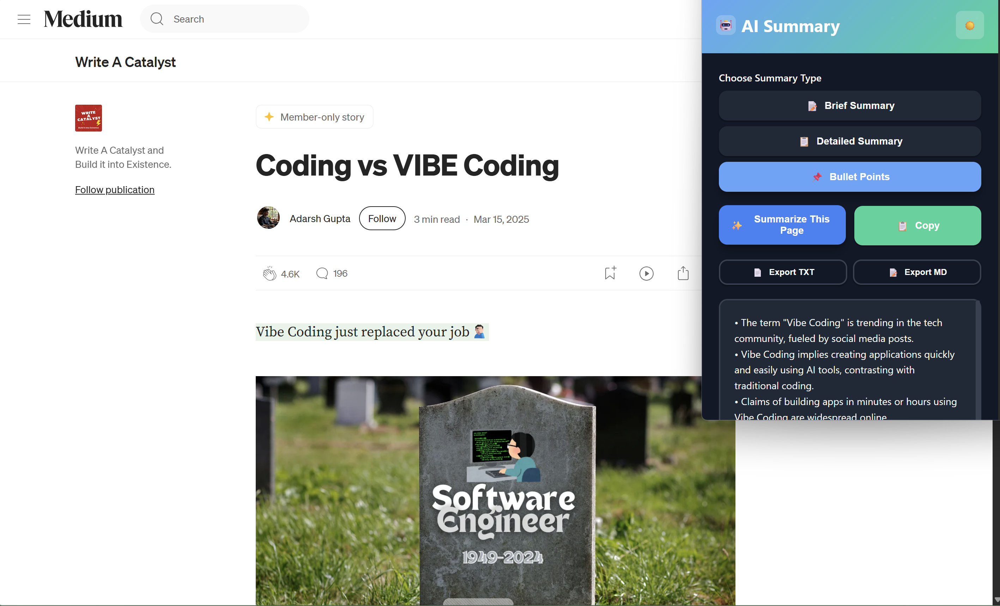

# Blog Post Summarizer – Chrome Extension

AI Summary for Articles is an intelligent Chrome extension that leverages Google's Gemini AI to generate concise summaries of web articles. It helps users quickly digest information by providing brief summaries, detailed explanations, or bullet points of any article they're reading online.

## 📋 Project Overview

**Project Name**: Blog Post Summarizer - Chrome Extension

**Mission**: Transform lengthy web articles into concise, digestible summaries with a single click.

**Target Users**: Students, researchers, professionals, and casual readers who need to quickly understand article content.

**Core Value Proposition**: Save time and improve comprehension by providing AI-powered article summaries in multiple formats.

## 🔑 Core Features

### 🔄 Multiple Summary Types

- **Brief Summary**: Concise overview of the article's main points
- **Detailed Summary**: Comprehensive summary with key details and arguments
- **Bullet Points**: Key takeaways in an easy-to-scan bullet point format

### 🖱️ One-Click Summarization

- Simple interface for instant article summarization
- Copy functionality to easily transfer summaries to other applications
- Export options (TXT and MD formats) for saving summaries

### 🧠 Smart Content Extraction

- Intelligent parsing of article content
- Focuses on relevant text while ignoring navigation, ads, and comments
- Special handling for Medium articles and similar platforms
- PDF support for summarizing PDF documents
- Image description extraction for better context

### 👤 User-Friendly Interface

- Clean, intuitive popup design
- Dark mode support for comfortable reading
- Minimal setup required

### ⚙️ Customizable Settings

- User-provided API key for security and control
- Options page for configuration



## 🏗️ Architecture Overview

### 🧩 Extension Components

- **Manifest V3 Compliant**
- **Content Scripts** for DOM parsing
- **Background Service Worker** for installation events
- **Popup UI** and **Options Page**

## 🛠️ Technology Stack

### 🔹 Frontend (Chrome Extension)

- Vanilla JavaScript
- HTML5 & CSS3
- Chrome Extension APIs (storage, tabs, runtime)

### 🔹 Backend Integration

- Google Gemini 1.5 Flash API
- RESTful API communication
- JSON data processing

### 🔹 AI/ML

- Google Gemini 1.5 Flash model
- Temperature setting: 0.2 (for factual summaries)
- Prompt engineering for different summary types

## 💻 Implementation Details

### Content Extraction

```javascript
function getArticleText() {
  // Check if the page is a PDF
  if (isPDF()) {
    return extractPDFText();
  }
  
  // Special handling for Medium articles
  if (window.location.hostname.includes('medium.com')) {
    return extractMediumArticleText();
  }
  
  // Try to find article element
  const article = document.querySelector("article");
  if (article) {
    // Extract image descriptions
    const imageDescriptions = extractImageDescriptions();
    return article.innerText + "\n\n" + imageDescriptions;
  }

  // fallback
  const paragraphs = Array.from(document.querySelectorAll("p"));
  const textContent = paragraphs.map((p) => p.innerText).join("\n");
  
  // Extract image descriptions
  const imageDescriptions = extractImageDescriptions();
  return textContent + "\n\n" + imageDescriptions;
}

// Extract image descriptions from alt text
function extractImageDescriptions() {
  const images = Array.from(document.querySelectorAll("img[alt]:not([alt=''])"));
  if (images.length === 0) return "";
  
  const descriptions = images.map(img => `Image: ${img.alt}`).join("\n");
  return "\n\nImage Descriptions:\n" + descriptions;
}

// Special function to extract text from Medium articles
function extractMediumArticleText() {
  const extractedText = [];
  
  // Get the article title
  const title = document.querySelector('h1');
  if (title) {
    extractedText.push(`# ${title.innerText}\n`);
  }
  
  // Find the section with the most paragraph elements - likely the main content
  const sections = document.querySelectorAll('section');
  if (sections.length > 0) {
    let mainSection = null;
    let maxParagraphs = 0;
  
    sections.forEach(section => {
      const paragraphCount = section.querySelectorAll('p').length;
      if (paragraphCount > maxParagraphs) {
        maxParagraphs = paragraphCount;
        mainSection = section;
      }
    });
  
    if (mainSection && maxParagraphs > 0) {
      extractedText.push(mainSection.innerText);
    }
  }
  
  return extractedText.join('\n\n');
}
```

### PDF Support

```javascript
function isPDF() {
  return document.contentType === 'application/pdf' || 
         window.location.href.toLowerCase().endsWith('.pdf');
}

function extractPDFText() {
  // Basic extraction from browser-rendered PDF
  const textElements = document.querySelectorAll('.textLayer div');
  if (textElements.length > 0) {
    return Array.from(textElements)
      .map(div => div.textContent)
      .join('\n');
  }
  
  // Fallback for simple PDFs
  return document.body.innerText;
}
```

### Dark Mode Implementation

```javascript
// Toggle dark mode
document.getElementById("theme-toggle").addEventListener("click", () => {
  document.body.classList.toggle("dark-mode");
  const isDarkMode = document.body.classList.contains("dark-mode");
  const storageObj = {};
  storageObj[CONFIG.ui.darkModeStorageKey] = isDarkMode;
  chrome.storage.sync.set(storageObj);
});

// Initialize dark mode from storage
document.addEventListener('DOMContentLoaded', () => {
  chrome.storage.sync.get([CONFIG.ui.darkModeStorageKey], (result) => {
    if (result[CONFIG.ui.darkModeStorageKey]) {
      document.body.classList.add('dark-mode');
    }
  });
});
```

### Export Functionality

```javascript
// Export as MD
document.getElementById("export-md").addEventListener("click", () => {
  const summaryText = document.getElementById("result").innerText;
  if (summaryText && summaryText.trim() !== "") {
    const summaryType = document.getElementById("summary-type").value;
    let mdContent = `# AI Summary\n\n`;
  
    // Add metadata
    const date = new Date().toLocaleString();
    mdContent += `Generated on: ${date}\n`;
    mdContent += `Summary type: ${summaryType}\n\n`;
  
    // Add the summary content
    mdContent += summaryText;
  
    const blob = new Blob([mdContent], { type: "text/markdown" });
    const url = URL.createObjectURL(blob);
    chrome.downloads.download({
      url: url,
      filename: CONFIG.export.defaultMdFilename,
      saveAs: true
    });
  }
});
```

### API Integration

```javascript
const res = await fetch(
  `https://generativelanguage.googleapis.com/v1beta/models/${CONFIG.api.model}:generateContent?key=${apiKey}`,
  {
    method: "POST",
    headers: { "Content-Type": "application/json" },
    body: JSON.stringify({
      contents: [
        {
          parts: [{ text: prompt }],
        },
      ],
      generationConfig: {
        temperature: CONFIG.api.temperature,
      },
    }),
  }
);
```

### Data Storage

```javascript
chrome.storage.sync.set({ geminiApiKey: apiKey }, () => {
  // Handle successful save
});
```

## 🚀 Setup Instructions

### From Chrome Web Store

1. Visit the Chrome Web Store (link to be added when published)
2. Click "Add to Chrome"
3. Follow the prompts to complete installation

### Manual Installation (Developer Mode)

1. Download or clone this repository
2. Open Chrome and navigate to `chrome://extensions/`
3. Enable "Developer mode" in the top-right corner
4. Click "Load unpacked" and select the extension directory
5. The extension will be installed and ready to use

### API Key Configuration

1. After installation, you'll be prompted to enter your Gemini API key
2. If not prompted automatically, click on the extension icon and then click on the settings icon
3. Get your API key from [Google AI Studio](https://makersuite.google.com/app/apikey)
4. Enter your API key in the settings page and click "Save Settings"

## 🧪 Usage Guide

1. Navigate to any article or PDF you want to summarize
2. Click on the extension icon in your browser toolbar
3. Select the type of summary you want (Brief, Detailed, or Bullet Points)
4. Click "Summarize This Page"
5. Wait a moment for the AI to generate your summary
6. Use the "Copy Summary" button to copy the text to your clipboard
7. Toggle dark mode using the moon/sun icon for comfortable reading
8. Export your summary as a text file or markdown document using the export buttons

## 📈 Future Development Opportunities

- Improve PDF text extraction with dedicated PDF.js integration
- Implement local storage fallback for API key
- Add customizable summary length options
- Integrate with other AI models as alternatives
- Add multilingual support
- Implement summary history and favorites
- Add OCR capabilities for image-based content
- Implement collaborative sharing features
- Extend this functionality for video input as well

## 📝 License

[MIT License](LICENSE)
